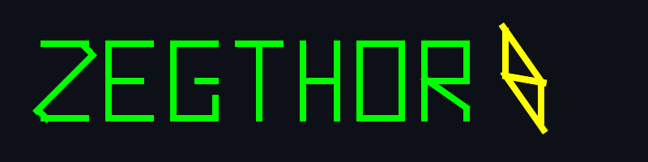

  

---

# Hi There !

I'm a French student passionate about full-stack development, currently studying to specialize in digital technologies and IT. I'm especially interested in creating modern websites and applications.

### My Skills & Goals

**Current Hard Skills:**
- **Programming Languages:** Python, PHP, C, JavaScript
- **Web Technologies:** HTML5, CSS3
- **Database Management:** MongoDB, PostgreSQL, PHPMyAdmin
- **Web Development:** Website creation, content integration, responsive design

**Goals I'm Working Towards:**
- Master advanced concepts in _Python_, _PHP_, and _JavaScript_
- Deepen my expertise in __modern web frameworks and libraries__
- Design websites that are efficient, user-friendly, and accessible to everyone — including people with visual impairments
- Build __responsive__ and __scalable__ web applications that work seamlessly across all devices
- Expand my database architecture skills with both SQL and NoSQL solutions

---

## My Projects (in team)

### Website Redesign for ASRock

Redesigned a website for the ASRock brand as part of a team challenge.

> https://github.com/Csolatus/challenge_web

### Website Event Management

Building of an event management system for any company.

> https://github.com/Zegthor91/challengeWeb_eventManagement

---

## 📊 GitHub Stats :

## 🔥 GitHub Streak :

---

## Contact

  
  &nbsp;
  <a href="mailto:idir.zegtitouche@efrei.net" style="vertical-align: middle;">idir.zegtitouche@efrei.net</a>

  
  &nbsp;
  <a href="https://www.linkedin.com/in/idir-zegtitouche-369118333/" target="_blank" style="vertical-align: middle;">idir-zegtitouche-369118333/</a>

